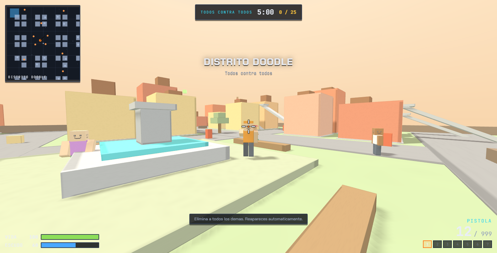
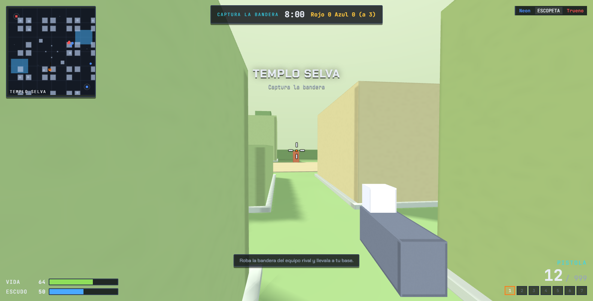

# BLOCKBURST

Shooter de arena para navegador con personajes y escenarios de bloques de colores.
Nace como un homenaje jugable: toma la idea base de un shooter de cuaderno dibujado a
mano (todos contra todos, oleadas, grapnel, katana) y le suma las caracteristicas de
arena de un shooter tipo Roblox (mapas de bloques, equipos, objetivos), con seis mapas
propios y cinco modos de juego.

No usa ningun recurso remoto: todo el motor, las fuentes y el audio viajan dentro del
repositorio, asi que abre incluso sin conexion.





## Como abrirlo

**Opcion 1 - abrir el archivo (lo mas rapido)**

Abre `index.html` con doble clic en Chrome, Edge o Firefox.

**Opcion 2 - servidor local (recomendado)**

```bash
npm run serve
# o
npx --yes serve .
```

Y entra en la direccion que imprime la consola.

**Requisitos:** un navegador con WebGL y raton. No hay build, no hay `npm install`.

## Controles

| Accion | Tecla |
|---|---|
| Moverse | `W` `A` `S` `D` |
| Mirar | Raton |
| Disparar | Clic izquierdo |
| Apuntar (mira cerrada) | Clic derecho |
| Saltar | `Espacio` |
| Correr | `Shift` |
| Agacharse | `Ctrl` |
| Recargar | `R` |
| Cambiar de arma | `1` a `7` o rueda |
| Cambiar camara (1a / 3a persona) | `V` |
| Marcador | `Tab` |
| Pausa | `Esc` |

## Modos de juego

| Modo | Formato | Objetivo |
|---|---|---|
| Todos contra todos | Individual | Primero en llegar a 25 bajas, o mas bajas al agotarse el tiempo |
| Duelo por equipos | Rojo vs Azul | El equipo que alcanza 50 bajas |
| Supervivencia | Individual | Resistir oleadas de zombis; cada oleada trae mas y mas fuertes |
| Captura la bandera | Rojo vs Azul | Robar la bandera rival y traerla a la base propia, tres veces |
| Rey de la colina | Rojo vs Azul | Acumular 150 segundos dentro de la zona central |

## Mapas

| Mapa | Tema | Rasgo distintivo |
|---|---|---|
| Distrito Doodle | Atardecer urbano | Calles amplias, azoteas con rampas y plaza con fuente |
| Caldera Voxel | Roca y fuego | Rios de lava que quitan vida si los pisas |
| Glaciar Azul | Hielo | Superficie resbaladiza y lagunas heladas que frenan |
| Templo Selva | Jungla | Terrazas, pasarelas de piedra y pozas de agua |
| Azoteas Neon | Noche | Rascacielos, pasarelas suspendidas y niebla |
| Islas Flotantes | Cielo | Plataformas sobre el vacio; caer es morir |

Los seis mapas se generan con semilla fija, asi que son identicos en cada partida y
siempre colocan puntos de aparicion, rutas de bots y objetos contra la geometria real:
un validador automatico comprueba que nada quede dentro de un bloque.

## Armas

| Tecla | Arma | Rol |
|---|---|---|
| 1 | Pistola | Precision media, municion practicamente infinita |
| 2 | Subfusil | Cadencia alta, control a corta distancia |
| 3 | Escopeta | Ocho postas, letal de cerca |
| 4 | Rifle | Automatico equilibrado, el arma por defecto |
| 5 | Francotirador | Un disparo, mucho dano, retroceso fuerte |
| 6 | Katana | Cuerpo a cuerpo, sin municion |
| 7 | Lanzacohetes | Dano en area, ideal contra grupos |

Los barriles rojos explotan si les disparas y hacen dano en area a todo el mundo.

## Entidades del mapa

- **Cubos verdes:** +40 de vida.
- **Cubos azules:** +50 de escudo (absorbe la mitad del dano entrante).
- **Cubos amarillos:** recargan municion de todas las armas.
- **Cubos naranjas:** +2 cohetes.
- **Barriles rojos:** explotan.

Los objetos reaparecen solos tras 22 segundos y, en Supervivencia, se reabastecen al
superar cada oleada.

## Estructura del proyecto

```
index.html                 Estructura de la interfaz (menu, HUD, pausa, resultados)
styles/ui.css              Sistema visual completo (paleta, tipografia, paneles)
src/util.js                Utilidades y generador pseudoaleatorio con semilla
src/audio.js               Efectos de sonido sintetizados con WebAudio
src/input.js               Teclado, raton y pointer lock
src/world.js               Construccion del mundo, colisiones, rampas y raycast
src/avatar.js              Personajes de bloques y animacion
src/weapons.js             Definicion de armas y modelos en primera persona
src/maps.js                Generacion de los seis mapas
src/bots.js                IA de bots y zombis
src/modes.js               Logica de los cinco modos
src/hud.js                 HUD, marcador, killfeed y minimapa
src/game.js                Nucleo: bucle, fisica, combate y camara
src/main.js                Arranque, menus y pantallas
vendor/three.min.js        Motor 3D local (Three.js r149, licencia MIT)
assets/fonts/              Fuentes auto-hospedadas (Chakra Petch, JetBrains Mono)
tools/                     Validadores y simulacion sin navegador
```

Todo el codigo del juego son scripts clasicos bajo un unico espacio de nombres
(`window.BLITZ`), cargados en orden desde `index.html`. Eso permite abrir el proyecto
directamente desde el disco sin servidor ni empaquetador.

## Desarrollo y verificacion

```bash
npm run check      # Comprueba la sintaxis de todos los modulos
npm run validate   # Verifica geometria, spawns, rutas y objetivos de los 6 mapas
npm run simulate   # Ejecuta 6 partidas completas sin navegador y busca excepciones
npm run capture    # Abre el juego en Chrome headless y guarda capturas en docs/
npm test           # check + validate + simulate
```

`tools/simulate.js` sustituye Three.js y el DOM por stubs y corre partidas reales
(fisica, disparos, IA, modos, HUD) durante decenas de segundos simulados. Es la forma
mas rapida de detectar una regresion sin abrir el navegador.

`tools/screenshot.js` levanta el servidor local, abre Chrome en modo headless por el
protocolo de depuracion y guarda cinco vistas (menu, partida, personaje, supervivencia y
primera persona), ademas de informar de cualquier error de consola. Necesita Chrome o Edge
instalados y no usa dependencias externas.

## Como modificar cosas

| Quieres cambiar | Toca esto |
|---|---|
| Colores, tipografia, tamano de paneles | `styles/ui.css` (variables al principio de `:root`) |
| Textos del menu, resumen y consejos | `src/main.js` |
| Un mapa (geometria, tema, tamano) | `src/maps.js` |
| Danos, cadencia, cargadores | `src/weapons.js` |
| Dificultad y comportamiento de los bots | `src/bots.js` (tabla `PRESETS`) |
| Reglas de un modo | `src/modes.js` |
| Velocidad, salto, gravedad, retroceso | `src/game.js` y el campo `friction`/`jump` del mapa |

## Estado y siguientes pasos

Version jugable en solitario: tu contra bots con IA, con los cinco modos completos.
Lo siguiente en la lista:

- Multijugador en red (servidor autoritativo y salas).
- Editor de mapas dentro del juego.
- Mas armas y granadas.
- Progresion y desbloqueables.

## Creditos y licencia

Codigo bajo licencia MIT (ver `LICENSE`). Three.js r149 bajo licencia MIT.
No reproduce marcas, logos ni recursos de terceros: el estilo de bloques es una
interpretacion propia del genero.
